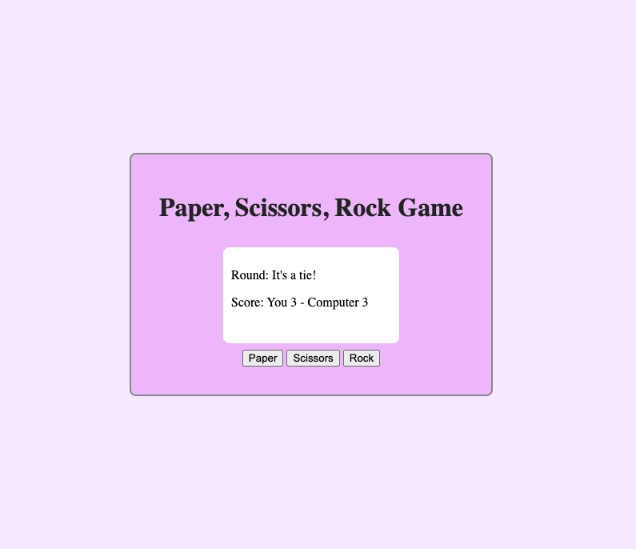

# Rock Paper Scissors Game

This is a simple browser-based Rock Paper Scissors game built using HTML, CSS, and JavaScript.

[👉 Live Demo](https://edenjermendi.github.io/paper-scissors-rock/)

## Features

- Click buttons to play.
- First to 5 wins the game.
- DOM updates show results and score.
- Styled with custom CSS.

## Screenshot

## How It Works

The project started with a simple console version. I later added:
- Button-based UI
- DOM manipulation to show results and scores
- Basic styling for a clean layout

Made with ❤️ as part of [The Odin Project](https://www.theodinproject.com/).